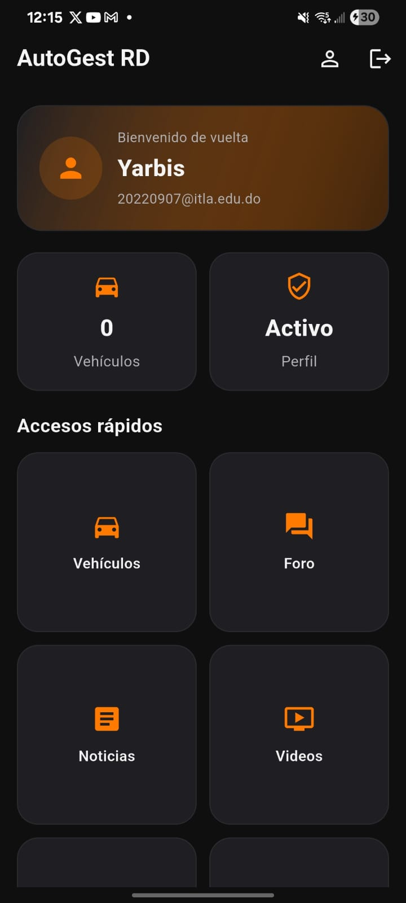
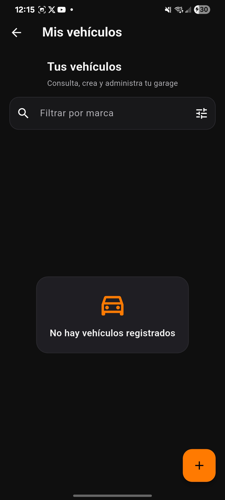
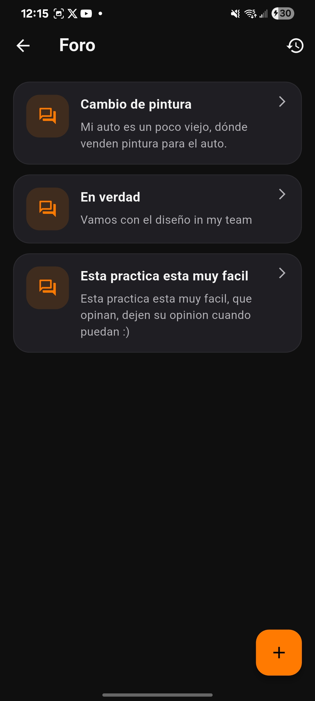
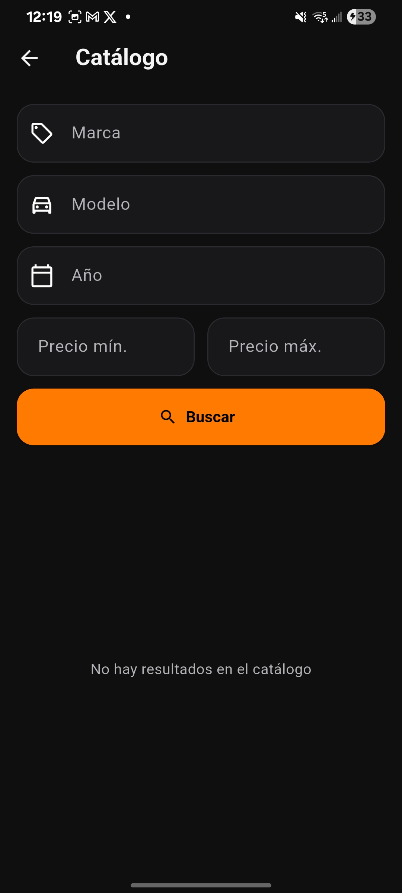
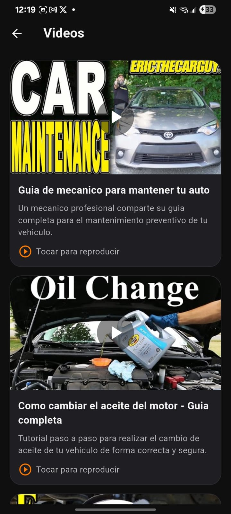
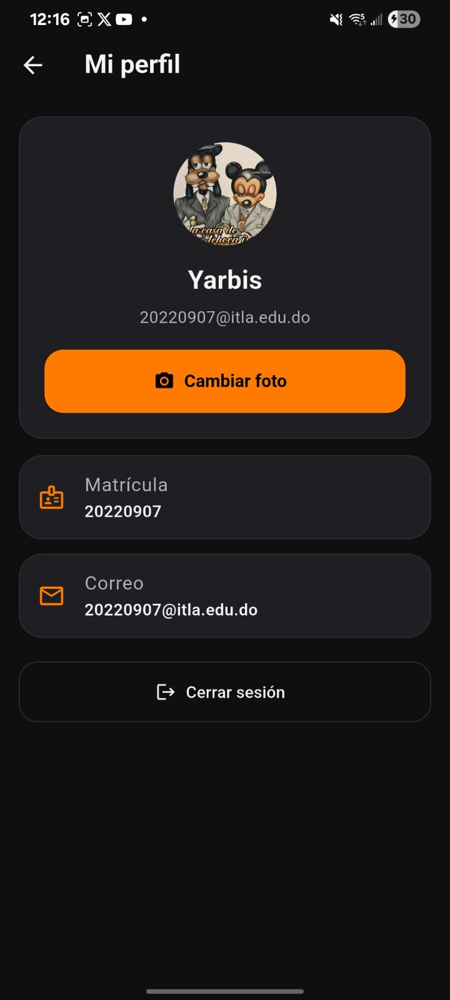

# 🚗 AutoGest RD


**AutoGest RD** es una solución integral móvil desarrollada en Flutter para la gestión inteligente de flotas vehiculares y finanzas personales. Diseñada con un enfoque "Fintech", la aplicación permite a los usuarios llevar un control exhaustivo de sus vehículos, mantenimientos y economía, mientras interactúan con una comunidad activa.

---

## 📱 Características Principales

### 🔐 Seguridad y Perfil
* **Autenticación Segura:** Sistema de login y registro de usuarios.
* **Gestión de Perfil:** Perfil de usuario dinámico con edición de fotografía utilizando acceso a la galería nativa del dispositivo.

### 🚘 Gestión de Vehículos (Core)
* **CRUD de Vehículos:** Registro, actualización y eliminación de vehículos en la cochera digital.
* **Telemetría de Desgaste:** Monitoreo del estado y vida útil de las gomas (neumáticos).
* **Bitácora de Mantenimiento:** Control histórico de servicios y reparaciones preventivas/correctivas.

### 💰 Panel Financiero (Fintech Dashboard)
* **Gestión de Combustible:** Registro detallado de consumo y gastos en estaciones de servicio.
* **Control de Ingresos y Gastos:** Módulo contable para registrar la rentabilidad del vehículo (ideal para uso personal o trabajo en plataformas de transporte).

### 🧠 Comunidad y Multimedia
* **Foro Interactivo:** Espacio comunitario para crear hilos de discusión, hacer preguntas y responder a otros conductores.
* **Feed de Noticias:** Consumo de artículos relevantes con carga de imágenes dinámicas.
* **Centro Educativo:** Integración de videos tutoriales y guías de mecánica básica/avanzada.

---

## 🎨 UI / UX Design

La interfaz ha sido cuidadosamente diseñada para minimizar la fatiga visual y ofrecer una experiencia premium:
* **Dark Mode Nativo:** Tema oscuro moderno y profundo.
* **Paleta de Colores:** Contraste de alto impacto utilizando **Negro Profundo + Naranja Neón**, evocando deportividad y tecnología.
* **Dashboard Fintech:** Tarjetas de información, indicadores de progreso y navegación limpia basada en las guías de *Material 3*.

---

## 🧱 Arquitectura y Stack Tecnológico

El proyecto sigue buenas prácticas de separación de responsabilidades y manejo de estado:

* **Framework:** [Flutter](https://flutter.dev/) (Dart)
* **State Management:** `provider` (Gestión reactiva de la interfaz sin acoplamiento).
* **Networking:** `http` (Consumo eficiente de la API REST del ITLA).
* **Hardware & OS:**
  * `image_picker`: Captura y selección de imágenes desde el sistema de archivos.
  * `url_launcher`: Redirección a enlaces externos y manejo de URIs.

---

## 🔌 Integración API REST

El ecosistema de datos de la aplicación está respaldado por un backend centralizado.

* **Base URL:** `https://taller-itla.ia3x.com/`
* **Documentación de Endpoints:** [Ver Instrucciones de la API](https://taller-itla.ia3x.com/instrucciones)

---

## 📸 Capturas de Pantalla


| Dashboard Financiero | Gestión de Vehículos | Foro de Comunidad |
| :---: | :---: | :---: |
|  |  |  |
| Catalogo | Noticias | Videos |
|  |  |  |
||Perfil||
||  ||
---

## 🚀 Instalación y Despliegue

1. Clona este repositorio en tu máquina local:
   ```bash
   git clone https://github.com/SEP112015/autoguest_rd.git
   ```
2. Navega al directorio del proyecto:

    ```Bash
    cd autogest-rd
    ```
3. Descarga e instala las dependencias:

    ```Bash
    flutter pub get
    ```

4. Ejecuta la aplicación en tu emulador o dispositivo físico:

    ```Bash
    flutter run
    ```

## 👨‍💻 Autores y Desarrolladores
Proyecto desarrollado para el Instituto Tecnológico de las Américas (ITLA) por:

- Sebastian Escaño Pérez - Desarrollo Mobile
- Yarbis Beltré Mercedes - Desarrollo Mobile